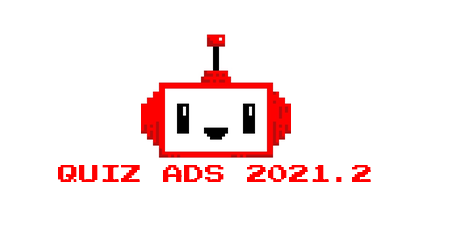
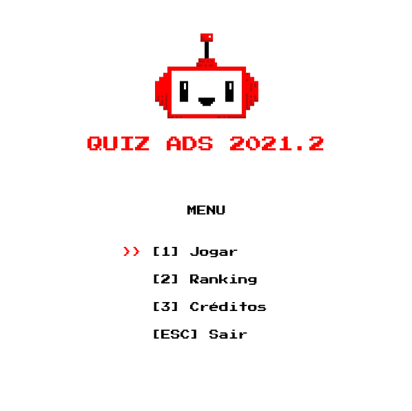
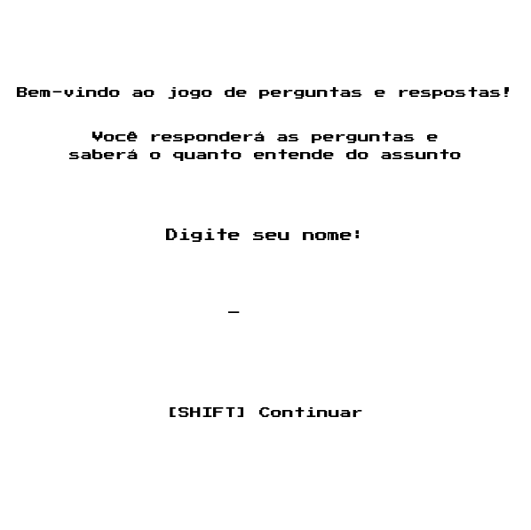
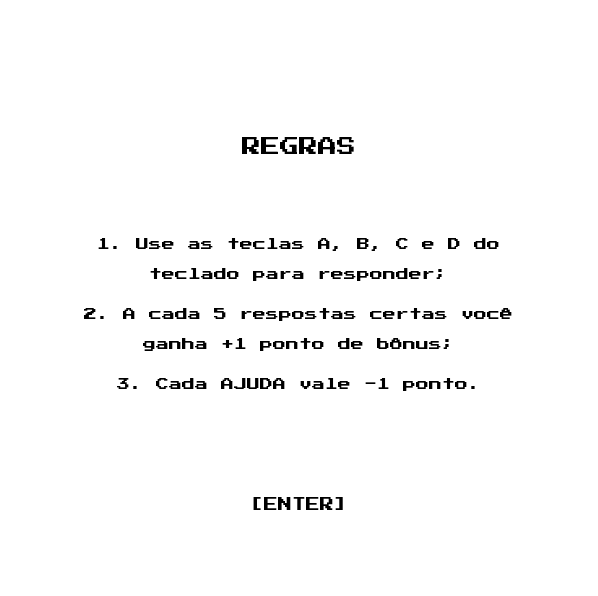
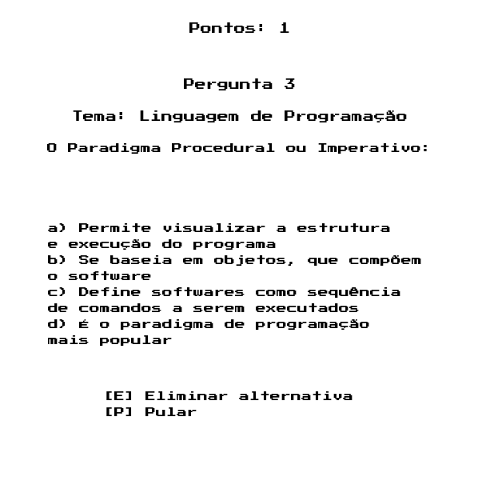
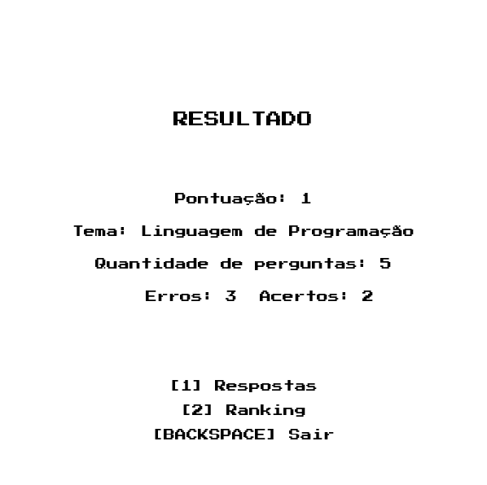
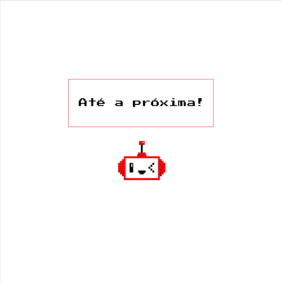

<h1 align="center">
    
</h1>

<h1 align="center">
   👾 <a href="#"> QUIZ GAME </a>
</h1>

<h3 align="center">
    Technology themed quiz game made for an university assignment.
</h3>

  
    
<!--     -->

<h4 align="center"> 
	 Status: Finished
</h4>

 <a href="#about">About</a> •
 <a href="#features">Features</a> •
 <a href="#layout">Layout</a> • 
 <a href="#contributors">Contributors</a> • 
 <a href="#author">Author</a> • 
 <a href="#user-content-license">License</a>

## About

This quiz game was made for an university assignment of the 'Algorithm and Programming logic' subject.
The IDE Portugol was used to make this game.
To play the game you must have Portugol Studio downloaded in your computer because of the "Graficos" library.

---

## Features

- [x] Game saves the player's information:
   - [x] name
   - [x] choosen theme
   - [x] quantity of questions

- [x] Game options:
   - [x] skip a question
   - [x] eliminate a wrong answer

- [x] Results:
   - [x] shows correct answers and player's answers
   - [x] saves a file with game ranking
   - [x] it is possible to delete the ranking results

---

## Layout

  

  
  
  

  

  
  
  

---

## Contributors

A big thanks to this group that made this product a success :)

<table>
  <tr>
    <td align="center"><a href="https://github.com/t09352021"> <b>Bruna Silvestre do Nascimento</b></a> 
	<a href="https://www.linkedin.com/in/brunasilvestrenascimento/"><b>LinkedIn</b></a> </td>
    <td align="center"><a href="https://github.com/naomy19"> <b>Camilla Naomy Tsuda</b></a> 
        <a href="https://www.linkedin.com/in/camilla-naomy-tsuda-33839b133/"><b>LinkedIn</b></a> </td>
    <td align="center"><a href="#"> <b>Mariana Borges Ramos</b></a> </td>
    
  </tr>
</table>

## How to contribute

1. Fork the project.
2. Create a new branch with your changes: `git checkout -b my-feature`
3. Save your changes and create a commit message telling you what you did: `git commit -m" feature: My new feature "`
4. Submit your changes: `git push origin my-feature`
> If you have any questions check this [guide on how to contribute](./CONTRIBUTING.md)

---

## Author

<a href="https://github.com/naomy19">
 
  
 <b>Camilla Naomy Tsuda</b></a> 
  

 

---

<!-- ## License

This project is under the license [MIT](./LICENSE).

Made with love by Thiago Marinho 👋🏽 [Get in Touch!](Https://www.linkedin.com/in/tgmarinho/) -->
<!-- 
--- -->

##  Versions of README

[English](./README.md)  |  
<!-- [Portuguese](./README-pt.md)
 -->
